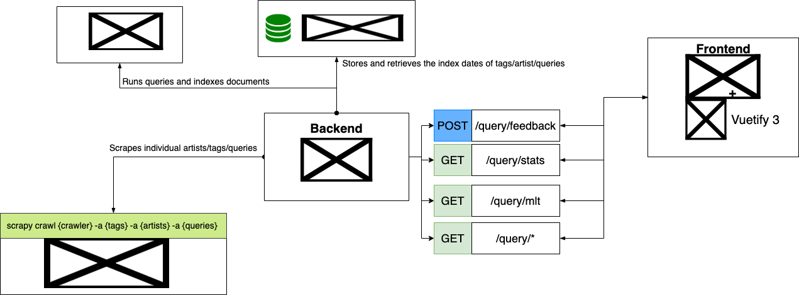
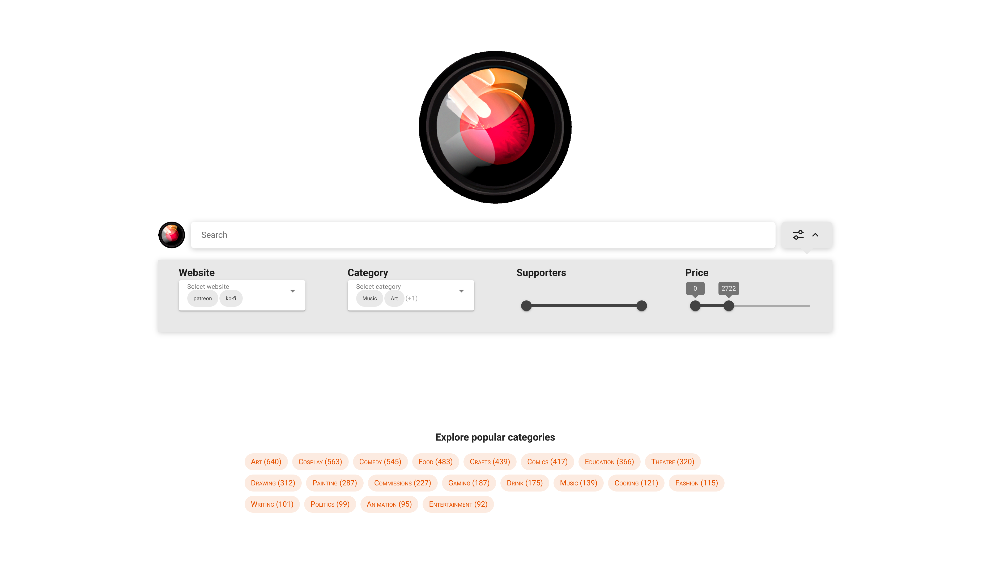
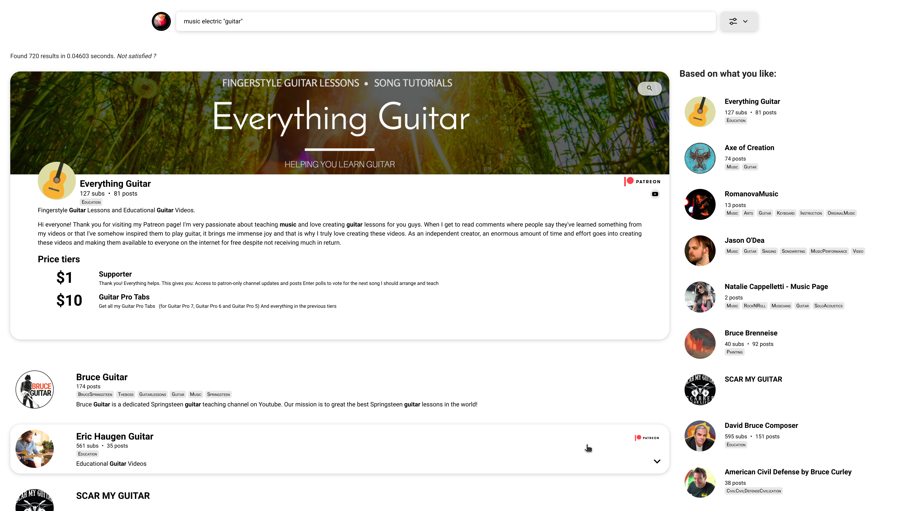

# Project Report: Information Retrieval

**Authors**: Albert Cerfeda - Alessandro Gobbetti

This project was realized in the span of about 2 weeks (14 days).

Developed as part of the group project for *Information Retrieval SA
2021-2022*, part of BSc INF at Università della Svizzera Italiana (USI) in Lugano, Faculty of Informatics, Switzerland

# Introduction

**Banana** aims to be a search engine to discover and fund your
favourite content creators.\
We put efforts into making our system sustainable and self-improving,
without requiring us to start processes or intervene manually. We faced
quite a lot of challenges, mostly regarding Solr and
its very steep learning curve.\
Nonetheless, we are satisfied enough with the current state of the
project. There are still many improvements to be done, but considering
the time on our hands this is good enough.

# Tech stack



In our system there are dfferent components that operate independently
from one another. It's important to gain understanding of the moving
pieces that make our system work.

## Scrapy

Scrapy is an open source Python framework for crawling and scraping
websites. Our backend invokes the Scrapy process for
crawling/scraping a set of artists, categories or search queries. The
scraped data output is then directed into a `.json` file, ready to be
read and indexed by Solr.

## Solr

Solr is a popular enterprise search platform built on top of *Apache
Lucene. It includes features like distributed indexing, replication
and load-balanced querying, and automatic recovery.\
It is responsible for indexing and querying the collection. It retrieves
the artists most pertinent to the user's search query and filters.

## NodeJS + MongoDB 

For our backend we chose NodeJS `v. 19.2.0`. It handles user queries,
relevance feedback and coordinates and interacts with all the other
components of our stack.\
It also handles the scraping and indexing process, as it periodically
provides the Solr and Scrapy processes with the authors/tags/queries to
scrape and index. The MongoDB database serves for the purpose of storing
and remembering the index timestamp for each author/tag/query.\
The user has the option to label as \"unsatisfying\" the search results
for a query: the backend will then instruct Scrapy to scrape the search
results of each site for the provided user query.\
It performs additional computation on the user's query such as
pagination, query reranking, sorting, \"more like this\" similarity
feature and input sanification.\
It also adopts some security measures like using a rate limiter to
protect from DDOS attacks. See Section 4 for a
more detailed explanation of how the backend works.

## Vue.js 3

The frontend plays the crucial part of presenting the retrieved
documents. It is responsible for the user interface, the user experience
and the interaction with the backend. It is built with Vue.js 3, using
Vuetify 3 as a UI library. Vue.js allows us to create a reactive and
dynamic user interface, while Vuetify provides us with a set of
pre-built components and styles.\
During the development of the frontend, we discover that the Vuetify
library is not yet fully finished and stable. This caused us some
problems, but we managed to overcome them.

# Retrieving and indexing documents
Retrieving and indexing documents is the core of any search engine. In
this section we will describe these two processes in detail.

## Crawling process

Retrieving documents from the web is a complex process. The crawling
process is used to retrieve documents from the web. This is done by a
crawler (also called spider), that automatically visit web pages and
read their content. When a crawler visits a web page, it extracts the
links to other pages and adds them to the list of pages to visit. This
process is repeated until the crawler has visited all the pages it can
find. In the case of our project, we used the [Scrapy
framework](https://scrapy.org/) to crawl the web pages.

In order to properly crawl a website we need to understand how it is
structured. For this reason, this was a fundamental part in the project
to decide which sites to crawl. Some websites are not meant to be
crawled easily.

An ideal website to crawl would have a list of links to all the pages to
crawl (all the creators using the site).
SubscibeStar is
a perfect example of this: the whole website is static and the creators
are listed. The only thing to do is visit every site in the list on
every page and extract the information. This is not the case for most
websites, and we had to find a way to crawl them.

Ko-fi, for example, does not list all the
creators, so we had to find another way to crawl it. Since creators have
tags associated with them, we decided to use them and search by
category.

Patreon does not even have categories, so we
decided to query the site using random super-generic keywords (like
\"music\" or \"art\"). This way we are not sure to find all the
creators, but at least we can crawl a lot of them.

The crawling process is not always straightforward, and we had to make
some compromises. When we crawl a website we are sending thousands of
requests to a webserver, and we need to be careful not to overload it or
get banned. Some websites have a limit on the number of requests per
second. Between the three websites we crawled,
Ko-fi has the most restrictive policy.

We used some good practices to safely crawl the websites. To avoid
sending too many requests at the same time, we used a delay between
requests. For the case of Ko-fi, we set the
`DOWNLOAD_DELAY` to 3 seconds, which means that the crawler
will wait a random interval between $0.5 \cdot 3$ and $1.5 \cdot 3$
seconds before sending the next request since the
`RANDOMIZE_DOWNLOAD_DELAY` setting is enabled (by default).

Another good practice is to use a *user agent* to identify the crawler.
This is a string that is sent with every request, and it is used by the
webserver to identify the client. The *user agent* contains information
about the client, like the operating system, the browser, and the
version. To be more clear, an example of user agent is:

``` {.bash fontsize="\\footnotesize"}
Mozilla/5.0 (X11; Linux x86_64) AppleWebKit/537.36 (KHTML, like Gecko) Chrome/107.0.0.0 Safari/537.36
```

At every request, thanks to the
`scrapy.downloadermiddlewares.useragent.UserAgentMiddleware`
middleware our crawler uses a random user agent.

Another problem we faced is that some websites are javascript-heavy, so
we had to wait some time for the page to load. To solve this problem, we
used the `scrapy-playwright` library, which is a middleware that uses
the [Playwright](https://playwright.dev/) library to interact with the
browser. It simulates a real user using a real browser, so it can wait
for the page to load and interact with it. We used it to wait until a
css selector was present on the page, but it can do much more, like
clicking on buttons or filling forms.

The spiders we coded have a common structure, they can take as parameter
a list of tags to search, a list of urls of creators pages, or a list of
queries to perform on the website. The default parameters are used when
we want to crawl the whole website. The spiders have a method
`parse` that is called on the pages listing artists. This
method extracts the urls of the artists pages and calls the
`parse_artist` method on them. It also extracts the urls of the
next pages and calls itself on them. The `parse_artist` method
is the one that extracts the information from the artist page. All the
information are stored in the same format tanks to the
`artist_dict.make` method. The info we save for each artist
are:

-   `site`: the website we crawled (ko-fi, patreon,
    subscribestar)

-   `page_link`: the url of the artist page

-   `artist_name`: the name of the artist

-   `artist_image`: the url of the artist image

-   `artist_banner`: the url of the artist banner

-   `bio`: a short description of the artist

-   `bio_long`: a more detailed description of the artist

-   `amount_post`: the number of posts the artist has

-   `amount_subs`: the number of subs the artist has

-   `price_tiers_title`: a list of all the price tiers titles

-   `price_tiers_monthly`: a list of strings of all the price
    tiers amounts per month

-   `price_tiers_monthly_chf`: a list of all the price tiers
    amounts converted to CHF

-   `price_tiers_description`: a list of all the price tiers
    descriptions

-   `tags`: a list of tags associated with the artist

-   `socialmedias`: a list of social media links

-   `indexDate`: the date of the crawling

All the crawled data can be outputted by scrapy in a json file, that we
use in the next section to index the data.

To run the spiders, navigate to the `crawler/crawler` folder and
run the following command:

``` 
scrapy crawl <spider-name> [OPTIONAL PARAMETERS] -o outputfile.json
```

where `<spider-name>` is the name of the spider you want to run,
and `outputfile.json` is the name of the file where the data will
be saved.

The optional parameters can be passed as
`-a tags=[...] -a artists=[...] -a searches=[...]`.

## Indexing process

Once the data are crawled, we need to index it to then be able to find
the documents that match a query. We use the Apache Solr search engine
to do so, which is an open-source search engine that uses the Lucene
library to build an inverted index.

# The glue that keeps everything together: the backend 

Our backend is center of operations. It starts and administers most of
the processes that happen on the server, hidden from the user.

## Automatic scraping

The backend relies on a MongoDB database for storing the index dates of
tags and for storing the search queries searched for on the different
sites.\
All the configuration options for the backend are stored inside the
*config.json* file. There you can customize almost every aspect of the
application, like the page size, how much time needs to pas for
considering a document as expired and therefore put it up for scraping.\
The backend uses a *rate limiter* for limiting the amount of received
requests, ensuring some degree of protection from DDoS attacks.

## Handling user queries

There are different API endpoints available to the frontend:

1.  /query/feedback With this route the user can provide explcit
    feedback for the search results of a query.\
    Once a user is dissatisfied with a query's search results, the query
    in question is saved into MongoDB to be automatically earched for
    and indexed for on the different sites.

2.  /query/stats This route allows the frontend to retrieve all
    statistics of the collection. This way the frontend can display the
    filters with the appropriate values and display the categories that
    are most popular on the homepage.

3.  /query/mlt This route is used by the frontend for retrieving artists
    that are similar to a set of other artist(s). We used the \"More
    Like This\" method handler in Solr.

4.  /query/\* Finally the most useful route: here the user can provide
    search query terms and filter values and the backend answers with
    the ranked documents.\
    A very interesting query preprocessing is done: All the words of the
    query are escaped with starts (ie '\*') therefore enabling partial
    query matching. If a user types a query term escaped with quotes (ie
    \"quote\") the backend performs an EXACT query match for those
    words. This feature was clearly inspired to Google's Search engine.

## Presenting documents to users: the frontend

The search engine is not the only part of an IR system, we also need to
present the documents to the user and provide a way for them to interact
with the documents, perform queries and in general brouse the system.
The frontend does it.




The homepage shown in contains a search bar where the user can type a
query and press enter to perform it. Some of the most popular tags are
also shown, and the user can click on them to quickly retrieve the
documents associated with them. The user can also click on the *Advanced
search* button to perform a more complex query: a form is shown below
the search bar where the user can specify the websites they want to
search in, the categories the artists must belong to, the amount of subs
they must have (through a range slider), and a range of prices the
artists must offer (through a range slider again). The user can specify
an exact match for the words in the query by putting them in double
quotes, otherwise The query is performed when the user clicks enter in
the search bar.




The results are shown in a list of cards (see ) sorted by the score of
the documents, which is computed by Solr. Each card contains the most
important information about the artist and the user can click on a card
to expand it and see more information about the artist and the price
tiers they offer. The words in the artist bio and description matching
the query are highlighted in bold. It is also possible to click on the
artist name or profile picture to be redirected to their page on the
website. Links to the social media accounts are also shown, and the user
can click on them to be redirected to the artist's social media page.
The tags associated with the artist are clickable and clicking on them
will perform a new query with the clicked tag as a filter. On the top
right of the expanded card, there is a button that allows the user to
sarch for artists similar to the one shown in the card. At the bottom of
the page, there is a pagination bar that allows the user to navigate
through the results.


On top of the results page, there is the same search bar as in the
homepage, so the user can quickly perform a new query. If the user
clicks on the logo at the top left of the page, they will be redirected
to the homepage. On the right side of the page, insted, a list of
artists is shown. These are the creators that the user might find
interesting. To compute this list, we keep track using cookies of the
last 10 artists the user has clicked on, and we show the 10 artists that
are most similar to them. Since these information are stored in the
cookies, the user is not identified and his/her privacy is preserved.
The similarity is computed by Solr using the `mlt` (More Like
This) query parser, which is a query parser that returns documents
similar to the ones specified in the query.

The query and the filters are stored in the URL of the page, so the user
can easily share the results of a query with someone else.

# User evaluation: how good is our search engine?

As a good practice, once we have built a search engine, we need to
evaluate it to see how good it is.

We used the standard System Usability Scale (SUS) questionnaire to
evaluate the usability of our system. The SUS questionnaire is a 10-item
questionnaire that measures the usability of a system. Each question is
rated on a 5-point Likert scale, from *strongly disagree* to *strongly
agree*. At the end of the questionnaire, we can compute the SUS score,
which is a number between 0 and 100 that indicates how usable the system
is.

Two extra questions were added to the questionnaire to evaluate more
specifically the system:

-   *I found what I was looking for?*

-   *I completed successfully all tasks?*

We asked 3 users to use the system and fill the SUS questionnaire. While
using the system we asked them to perform some tasks, such as searching
for artists, clicking on links and expanding cards.

The users where pretty confident in using the system, and they were able
to perform the tasks we asked them to do. They also started to use the
system on their own to browse the artists and find the ones they were
interested in, without us asking them to do specific tasks.

The results of the SUS questionnaire are shown in . The average score
for each question is computed by dividing the sum of the scores given by
the 3 users by 3. The SUS score can then be computed (ignoring the last
two quesitons). The SUS scores are 95, 92.5 and 92.5, which leads to an
average SUS score of 93.33, a pretty good score, considering that the
SUS score is between 0 and 100.

The users also answered the two extra questions we added to the
questionnaire that were more specific for a search engine. The testers
were very satisfied with the results of their queries, and they were
able to complete all the tasks they were asked to do.

Given the results of the SUS questionnaire, we can say that the system
is definitely usable and that the users are satisfied with it.

# How to run

The code of the system is available on GitHub at
<https://github.com/Alessandro-Gobbetti/IR>.

To run the crawler, navigate to the `crawler/crawler` folder and
run:

`scrapy crawl <spider-name> -o outputfile.json` (see for more
info).

To init solr just navigate to the `solr` folder and run
`make`. This will start the solr instance on port 8983, creates a
collection called `creators` with the proper schema. The MoreLikeThis
handler is also added.

To start the backend, navigate to the `backend` folder, install
the dependencies with `yarn install` and run
`yarn run start`. By running `yarn run solrinit` the
backend clears the Solr collection and reindexes all the data.

To start the frontend, navigate to the `frontend` folder, install
the dependencies with `yarn install` and run
`yarn run start`.

# Conclusion

To conclude this report, we can say that we have successfully built a
search engine for content creators on the internet. The system is able
to crawl the web and index the data, and it is able to perform queries
and return the results to the user. The backend automatically updates
the data every $n$ days, so the user can always find the most up-to-date
information about the artists. The system is also able to recommend
artists similar to the ones the user is interested in, and it is able to
show the most popular tags.

The data retrieved are presented in a nice way to the user, and the user
can easily interact with them expanding the cards to see more
information and clicking the links to the artists' pages. The
information shown are all the ones describin the artist, so in many
cases the user does not even need to click on the link to the artist's
page.

The user can also perform complex queries to find the artists that best
fit their needs. Since the crawling does not guarantee that all the
artists are crawled, the user can also specify the query to be performed
on the websites to improve the system.
